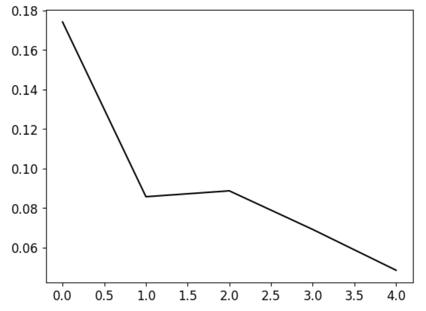
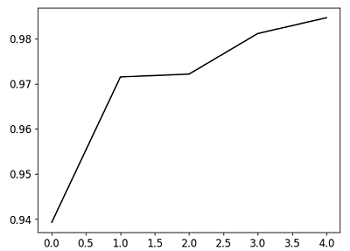
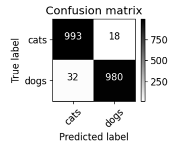

# Cat and Dog CNN with ResNet50

### 資料集來源：[Kaggle - Cat and Dog](https://www.kaggle.com/datasets/tongpython/cat-and-dog)
**注意**：由於資料集過大，無法直接包含在此。請從提供的 Kaggle 連結自行下載。

使用 ResNet50 再自行疊加其他神經網路層，將貓咪與狗的圖片進行分類，最後倒出 2 個神經元，分別代表貓狗。  


## Overview

- Language: Python v3.10.12
- Package: Tensorflow
- Model: CNN(ResNet50)

## Model Architecture

模型使用 **Cross Entropy** 作為損失函數，採用 **Adam** 優化器，學習率設定為 **0.0001**，並應用 **數據擴增** 技術來減少過擬合，透過生成訓練圖像的變化來達成。  


```
              OPERATION        DATA DIMENSIONS   WEIGHTS(N)   WEIGHTS(%)

              Input   #####       3  224  224
         InputLayer     |      ----------------          0         0.0%
                      #####       3  224  224
      ResNet50 (Base)  \|/     ----------------    2359808         1.7%
               -      #####     512  224  224
       MaxPooling2D   Y max    ----------------          0         0.0%
                      #####     512  112  112
      Convolution2D    \|/     ----------------     147584         0.1%
               relu   #####     128  112  112
       MaxPooling2D   Y max    ----------------          0         0.0%
                      #####     128   56   56
           Flatten    |||||    ----------------          0         0.0%
                      #####         50176
              Dense   XXXXX    ----------------    1605696        74.3%
               relu   #####          32
           Dropout    |||||    ----------------          0         0.0%
                      #####          32
              Dense   XXXXX    ----------------         64         2.8%
               relu   #####           2
              Dense   XXXXX    ----------------         64         2.8%
            softmax   #####           2
```

## Conclusion

### Loss



### Accuracy




### Confusion Matrix - Accuracy Rate 97.53%

