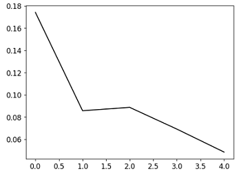
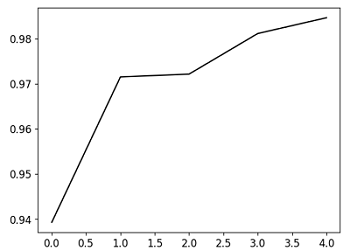

# Cat and Dog CNN with ResNet50

**(also provided Traditional Chinese version document [README-CH.md](README-CH.md).)**

### DataSet From [Kaggle - Cat and Dog](https://www.kaggle.com/datasets/tongpython/cat-and-dog)  

**Note**: dataset is too large to be included directly. Please download it yourself from the provided Kaggle link.

## Overview

- Language: Python v3.10.12
- Package: Tensorflow
- Model: CNN(ResNet50)
- Loss Function: Cross Entropy
- Optimizer: Adam, Learning Rate = 0.0001
- data augmentation to reduce overfitting

## Model Architecture

```
              OPERATION        DATA DIMENSIONS   WEIGHTS(N)   WEIGHTS(%)

              Input   #####       3  224  224
         InputLayer     |      ----------------          0         0.0%
                      #####       3  224  224
      ResNet50 (Base)  \|/     ----------------    2359808         1.7%
               -      #####     512  224  224
       MaxPooling2D   Y max    ----------------          0         0.0%
                      #####     512  112  112
      Convolution2D    \|/     ----------------     147584         0.1%
               relu   #####     128  112  112
       MaxPooling2D   Y max    ----------------          0         0.0%
                      #####     128   56   56
           Flatten    |||||    ----------------          0         0.0%
                      #####         50176
              Dense   XXXXX    ----------------    1605696        74.3%
               relu   #####          32
           Dropout    |||||    ----------------          0         0.0%
                      #####          32
              Dense   XXXXX    ----------------         64         2.8%
               relu   #####           2
              Dense   XXXXX    ----------------         64         2.8%
            softmax   #####           2
```

## Conclusion

### Loss



### Accuracy




### Confusion Matrix - Accuracy Rate 97.53%


