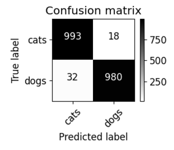

# Cat and Dog CNN with ResNet50

**(also provided Traditional Chinese version document [README-CH.md](README-CH.md).)**

### DataSet From [Kaggle - Cat and Dog](https://www.kaggle.com/datasets/tongpython/cat-and-dog)  

**Note**: dataset is too large to be included directly. Please download it yourself from the provided Kaggle link.

## Overview

- Language: Python v3.10.12
- Package: Tensorflow
- Model: CNN(ResNet50)
- Loss Function: Cross Entropy
- Optimizer: Adam, Learning Rate = 0.0001
- data augmentation to reduce overfitting

## Model Architecture

- **ResNet50 (Feature Extractor)**:  
  - Pre-trained on ImageNet.  
  - Used as a feature extractor by removing the top fully connected layers.

- **Convolutional Layer 1**:  
  - 512 filters, 3x3 kernel.  
  - ReLU activation function.

- **Max Pooling Layer 1**:  
  - 2x2 pool size to reduce feature map size.

- **Convolutional Layer 2**:  
  - 128 filters, 3x3 kernel.  
  - ReLU activation function.

- **Max Pooling Layer 2**:  
  - 2x2 pool size to reduce feature map size.

- **Flatten Layer**:  
  - Converts 2D feature maps into a 1D vector.

- **Dense Layer 1**:  
  - 32 neurons.  
  - ReLU activation function.

- **Dropout Layer**:  
  - Drop 40% of neurons to prevent overfitting.

- **Dense Layer 2 (Output Layer)**:  
  - 2 neurons (for cats and dogs).  
  - Softmax activation function.

## Conclusion

### Loss

### Accuracy

### Confusion Matrix - Accuracy Rate 97.53%

